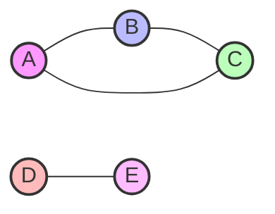
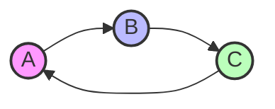
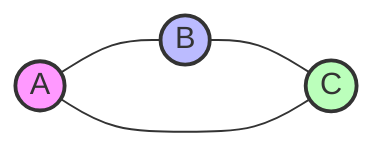
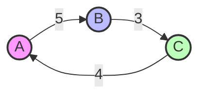
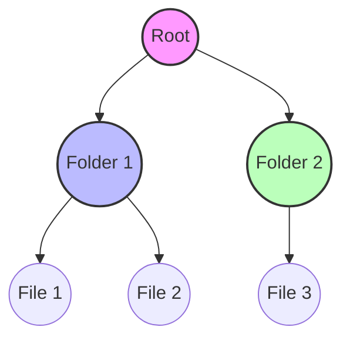
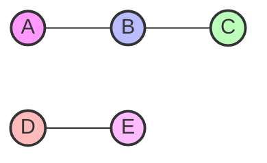
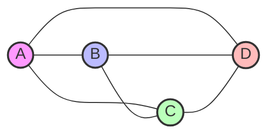
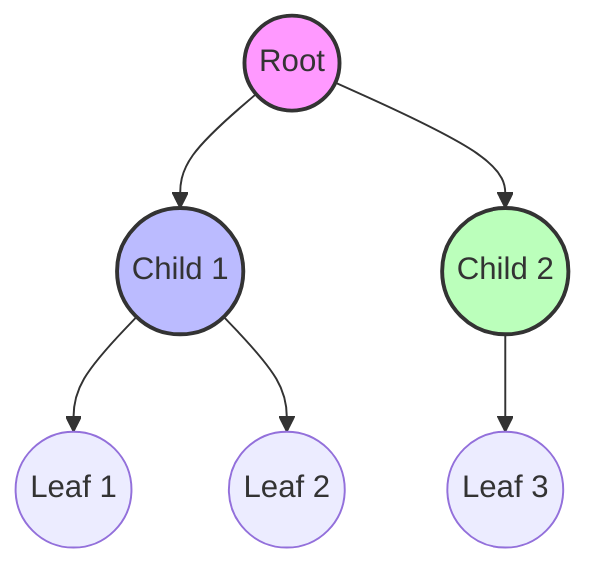
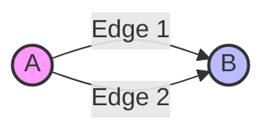

# 📊 Graph Data Structure

## 📌 Introduction

A **Graph** is a non-linear data structure that consists of:

* **Vertices (Nodes)** – Represent entities or objects
* **Edges** – Represent relationships or connections between vertices

Mathematically, a graph **G** is defined as:

```
G = (V, E)
```

Where:
* `V` is a set of vertices
* `E` is a set of edges connecting the vertices



## 📋 Types of Graphs

### 1. Directed Graph (Digraph)

* Edges have direction
* Represented as ordered pairs `(u, v)` indicating edge from `u` to `v`
* Example: Social media followers (A follows B)



### 2. Undirected Graph

* Edges have no direction
* Represented as unordered pairs `{u, v}`
* Example: Facebook friendship (A and B are friends)



### 3. Weighted Graph

* Each edge has a weight or cost associated with it
* Example: Map with distances between cities



### 4. Unweighted Graph

* No weights on the edges
* Simple connections between vertices

### 5. Cyclic Graph

* Contains at least one cycle (a path that starts and ends at the same vertex)
* Example: Circular dependencies in tasks


### 6. Acyclic Graph

* No cycles present
* Example: Hierarchical file system



### 7. Connected Graph

* There is a path between every pair of vertices
* All vertices are reachable from any other vertex

### 8. Disconnected Graph

* At least one pair of vertices has no path between them
* Contains multiple components



### 9. Complete Graph

* Every vertex is connected to every other vertex
* For `n` vertices, total edges = `n(n-1)/2` in undirected graph



### 10. Sparse and Dense Graphs

* **Sparse**: Few edges compared to number of vertices
* **Dense**: Number of edges is close to the maximum possible

### 11. Tree

* A special kind of graph that is connected and acyclic
* For `n` nodes, it has exactly `n-1` edges



### 12. Subgraph

* A graph formed from a subset of the vertices and edges of another graph

### 13. Multigraph

* Multiple edges (parallel edges) between the same pair of vertices



### 14. Graph Representation

#### Adjacency Matrix
* 2D matrix of size V×V
* `matrix[i][j] = 1` if there is an edge from vertex i to j
* `matrix[i][j] = 0` otherwise

#### Adjacency List
* Array of lists
* Each list contains the neighbors of a vertex
* More space-efficient for sparse graphs

## 💡 Use Cases

* **Social Networks**: Friend connections, follower relationships
* **Web Page Linking**: Google PageRank algorithm
* **Network Routing**: Dijkstra's, Bellman-Ford algorithms
* **Scheduling**: Task dependencies and project management
* **Game Development**: Maps and AI pathfinding
* **GPS Navigation**: Finding shortest paths
* **Circuit Design**: Electronic circuit connections
* **Dependency Resolution**: Package managers, build systems

---

*Note: All diagrams are interactive in supported Markdown viewers*

